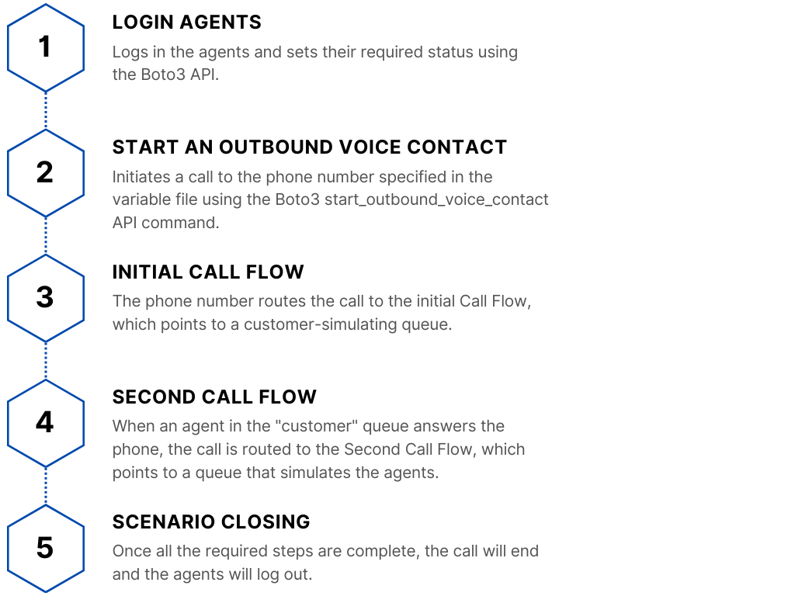
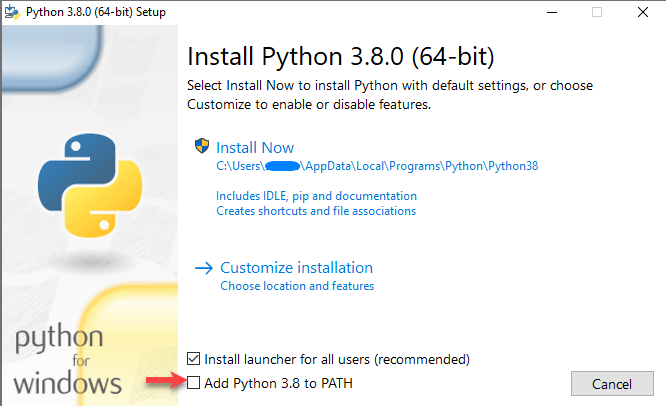
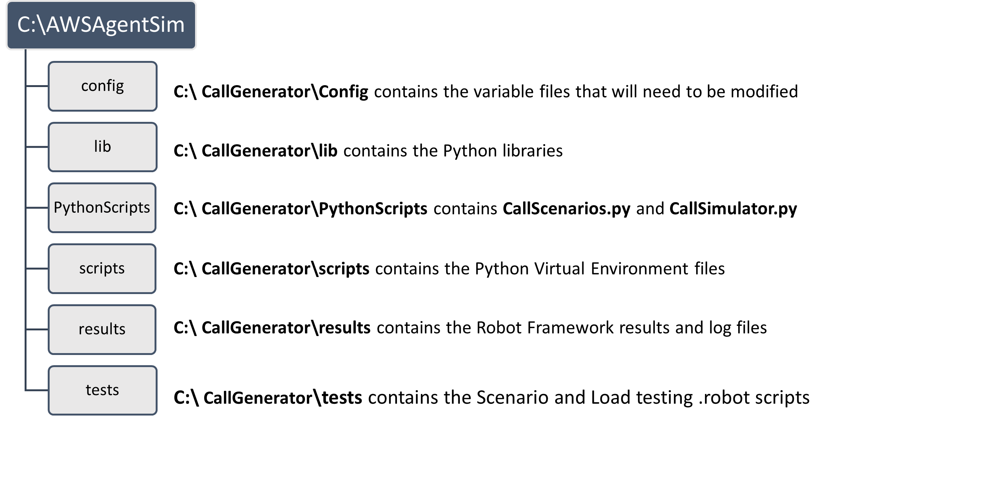
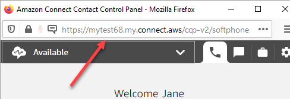
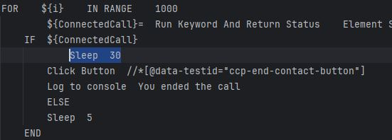
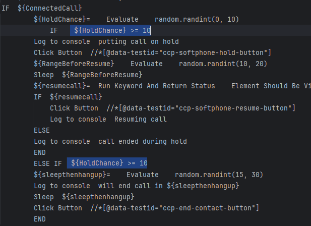
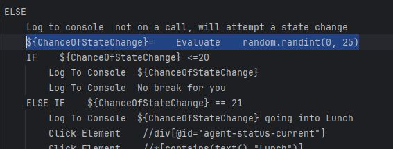

# Overview

Call Generator was developed to test a reporting solution for the Amazon Connect Cloud Contact Center. It automates placing calls into an Amazon Connect instance for load testing and call scenario simulations. This tool eliminates the need for time-consuming and repetitive manual tests for Amazon Web Services (AWS) Connect reporting solutions.

Call Generator follows the same flow of events every time it runs.




There are two different applications that the Call Generator can be used for:

**Call scenario testing**  
CallScenarios.py will generate different call scenarios to help verify the accuracy of reports. Two simple examples of different call scenarios are:

-   From an outside number, call the queue, and have the agent answer the call.
-   From an outside number, call the queue, and hang up before an agent answers the call.
-   From an outside number, call the queue, have the agent answer the call, and then have the agent transfer the call to another agent.


Additional scenarios, as well as changes to how agents interact with calls, can be easily added.

**Load Testing and Simulation**  
CallSimulator.py places a set number of calls into Amazon Connect. This can be useful for load testing, or to generate example call data.
   
Current capabilities:
-   Log in agents.
-   Place outbound calls in a queue.
-   Agents are set to auto-answer in AWS Connect.
-   Agents will put a call on hold based on a probability variable.
-   Agents end calls with random durations within set intervals.


## Technical Description

The Call Generators tech stack has four distinct technology components.

[Python](https://www.python.org/)  
Call Generator uses Python scripts to initiate and control all processes.

[AWS Software Development Kit (SDK) for Python (Boto3)](https://boto3.amazonaws.com/v1/documentation/api/latest/index.html)  
Boto3 is a Python library that enables AWS access through their Application Programming Interface (API). Call Generator uses Boto3 to Change Agent states and to make voice calls.

[Robot Framework](https://robotframework.org/)  
Robot Framework uses Selenium to interact with web applications and perform automated tasks. Call Generator uses Robot Framework to control the browser-based softphones used by the Amazon Connect agents.

[Amazon Connect](https://docs.aws.amazon.com/connect/latest/adminguide/what-is-amazon-connect.html)  
Amazon Connect is a cloud-based customer contact center service provided by AWS. Call Generator will automatically log in agents and place calls to your Amazon Connect Instance.

## Helpful Background Knowledge

This document assumes basic knowledge of Python, Amazon Connect, and Robot Framework with Selenium. Throughout the document, there are links to external user guides that may be helpful.

## Document Conventions

-   Variables are written in _Italics_
-   Files and folders are written in **Bold**
-   Hyperlinks are [underlined and in blue](https://en.wikipedia.org/wiki/Hyperlink)
-   `CMD or Python commands are in code blocks`

# System requirements


## Python
1.  Download the latest Python 3 from <https://www.python.org/downloads/>
2.  Run the installer and check the box marked “Add Python to PATH”  
4.  Once Python is installed, open CMD and change your directory to **C:\\CallGenerator**  
    `cd C:\CallGenerator`
5.  Create a new Python virtual environment (venv) inside **C:\\CallGenerator**  
    `python -m venv C:\CallGenerator`
6.  Activate the new venv  
    `Scripts\activate.bat`
7.  Install the required Python libraries    
   `pip install LibraryName`
       * robotframework
       * selenium
       * webdriver-manager
       * PyLibrary
       * robotframework-pabot
       * robotframework-autoitlibrary
       * robotframework-seleniumlibrary
       * robotframework-debuglibrary
       * boto3[crt]
       * awscli
       * datetime
       * psutil

## AWS CLI

Before making API calls using Boto3, you'll need your AWS Access Key and AWS Secret Access Key assigned to your AWS IAM user. If you do not have a Access Keys, then follow the [AWS Managing access keys](https://docs.aws.amazon.com/IAM/latest/UserGuide/id_credentials_access-keys.html#Using_CreateAccessKey) guide.

1.  Activate the virtual environment in CMD and configure the AWS CLI.  
    `python -m venv C:\CallGenerator
    aws configure`

You will be prompted to enter your
-   AWS Access Key ID
-   AWS Secret Access Key 
-   Default region name
-   Default output format

## Amazon Connect

This document assumes that you have already set up an Amazon Connect instance. To use the Call Generator, you will need:

-   Two queues with at least two agents assigned to each.
-   Two Call flows that direct inbound calls to each queue.
-   A phone number associated with one of the Call Flows.

# Installation and Configuration

Copy the CallGenerator folder to the **C:** drive root. The full path must be **C:\\CallGenerator**, otherwise the variables may not work.

*Folder Structure* 





## Variables

Some Variables will need to be modified to match your environment.

In C:\\CallGenerator\\Config\\variables.py
   


-   *ConnectURL*    
    The URL of Your AWS Connect Contact Control Panel (CCP). Do not use the URL you use to log in to AWS Connect; it must be the URL for the CCP itself.     
-   *Instanceid*  
    Your Amazon Connect Instance ID. You can find your instance ID by following the [Amazon Connect Administrator Guide](https://docs.aws.amazon.com/connect/latest/adminguide/find-instance-arn.html)
-   *DestinationPhoneNumber*  
    This phone number directs calls to the "customer queue" and must be formatted in E.164 format, ex-+1613123456.
-   *QueueId*  
    The Queue ID of the queue that simulates the agents. Depending on how you build your Call Flow, you may not need to define a QueueID. More information can be found in the [Boto3 documentation.](https://boto3.amazonaws.com/v1/documentation/api/latest/reference/services/connect/client/start_outbound_voice_contact.html)
-   *ContactFlowId*  
    The ID of the Contact Flow that sends the call to the Agents that will answer the “customer” call.
-   *Scenario_data*  
    Python dictionary of the agents used in the .robot scripts for the call scenarios in CallScenarios.py. You must add both the *initialFlow* agents and the *secondFlowAgents*. If you are unfamiliar with Python Dictionary, [w3schools.com](https://www.w3schools.com/python/python_dictionaries.asp) is a great resource.
-   *AgentPassword*   
    This is the password that your agents use to log into the CCP. If agents have different passwords, they can be entered into the .robot script. Modify the .robot scripts by replacing *${password}* in “Press Keys id:wdc_password *${password}*” with the cirect password.

## Call Scenario configuration
Before proceeding, you must modify the variables mentioned in [Installation and Configuration.](https://github.com/Ron-Lambert/CallGenerator/blob/main/README.md#installation-and-configuration)
### Modifying Call Length.
By default, the agent in the Second Flow will end the call after 30 seconds.
You can modify the length of the call by changing the Sleep duration between IF \${ConnectedCall} and Click Button //\*[@data-testid="ccp-end-contact-button"]
### Adding new Call Scenarios
1.  Make a copy of the **Scenario1** test folder and change the name to the new Scenario\#.
2.  Modify the **InitialFlowAgent.robot** and **SecondFlowAgent.robot** scripts to suit the needs of the new scenario. Each agent in the scenario will need its own .robot script. [The Robot Framework user guide](https://robotframework.org/robotframework/latest/RobotFrameworkUserGuide.html) is a good resource for learning how to modify and create .robot scripts.
3.  Add the agents to the *scenario_data* dicotnary in **variables.py**
4.  You can test your .robot scripts by activating the virtual environment and calling the .robot scripts directly.  
    `pabot --debugfile debug.log --outputdir C:\CallGenerator\Results --variablefile C:\CallGenerator\config\variables.py C:\CallGenerator\tests\CallScenarios\YourScenarioFolder`
5.  Add a new Scenario\# key with all the agents to the scenario_data dictionary in **variables.py**
6.  Add the new scenario to **CallScenarios.py**             
        a. Copy the below code   
        b. Replace *\# Region Scenario1* with your Scenario number.   
        c. Replace “*Scenario = "Scenario1*"” with the Scenario\# you created in step 3.   
        d. Modify *ScenarioTestFiles* to point towards the new scenario .robot scripts.     
        e. Paste the modified code at the bottom of **CallScenarios.py**   

```python
# region Scenario1
scenario = "Scenario1"
ScenarioTestFiles= ("pabot --debugfile debug.log --outputdir C:\\CallGenerator\\TempResults --variablefile C:\\CallGenerator\\config\\variables.py C:\\CallGenerator\\tests\\CallScenarios\\Scenario1")
# Makes List of Agents needed For Scenario 1
all_agents = scenario_data[scenario]["initialFlowAgents"] + scenario_data[scenario]["AnsweringAgents"]
print("Using the following agents for this scenario:", all_agents)
# Puts all the required agents into Offline
change_agent_states(all_agents,"Offline")
# Starts the robotscripts
RobotScripts = subprocess.Popen(ScenarioTestFiles)
print("The", scenario, "Robot scripts have started, PID is", RobotScripts.pid)
# Waits until all the required agents are available
for agent in all_agents:
user_state_check(agent, "Available")
# Places a call, won't move on until the call ends. End time is determined in the robot script.
Place_Call_And_Check_End(DestinationPhoneNumber, QueueId, ContactFlowId, Attributes)
# Checks to make sure that the robot scripts have ended properly, will end them forcefully if needed.
time.sleep(15)
if RobotScripts.poll() is None:
print("The Robot scripts did not end gracefully, forcing them to end now")
subprocess.call(['taskkill', '/F', '/T', '/PID', str(RobotScripts.pid)])
print(scenario,"has ended.")
# endregion
```

## Call Simulator configuration
Before proceeding, you must modify the variables mentioned in [Installation and Configuration.](https://github.com/Ron-Lambert/CallGenerator/blob/main/README.md#installation-and-configuration)
### Changing the amount of Calls.
By default, **CallSimulator.py** will place five calls before ending the script. You can increase that number by changing the variable *CallAmount* located near the bottom of *CallSimulator.py.*

### Putting a call on Hold

The **agent-\#.robot** script decides if the agent will put a call on hold by generating a random number between 0-10, and then using greater than or equal to decide if the call should be put on hold. You can change the chance by modifying the *\${HoldChance} \>=*
<br/>
<br/>
<br/>
<br/>
<br/>
### Agent State Change
Your Connect instance may have different state names. You will have to modify the state names to match your Connect instance. For example, if your Connect instance does not have a state called “Break”, but you do have one named “Lunch”, modify *Click Element //\*[contains(text(),"Break")]* to *Click Element //\*[contains(text(),"Lunch")]*
   
The likelihood of an agent changing states follows a similar logic to deciding whether to put a call on hold. Instead of adjusting the "greater than or equal to" condition, modify *\${ChanceOfStateChange}= Evaluate random.randint(0, 25).*

If you want more frequent state changes, you can lower the upper limit (currently 25), If you want fewer changes, increase the upper limit.


### Adding Agents

1.  For the first agent, modify C:\\CallGenerator\\tests\\CallSim\\Agent-1.robot directly.   
    a.  For all new agents, copy *Agent-1.robot* and rename it to the \# of the agent you are adding.
2.  Below is an excerpt from *Agent-\#.robot* script,   
    a.  Replace both instances of *Agent-1* with the Agent-\# you are creating.   
    b.  Replace *\${Username}* with the username of the Agent that the script is going to control.   
    c.  Replace *\${password}* with the password for the agent that the script is going to control.  

```
*** Test Cases ***
Program Launches
Agent-1
*** Keywords ***
Agent-1
${driver_path}= WebDriverFind.Get Driver Path With Browser chrome
Open Browser ${ConnectURL} browser=chrome options=add_argument("--disable-notifications");add_argument("--use-fake-ui-for-media-stream");add_argument("--use-fake-device-for-media-stream") executable_path=${driver_path}
Wait Until Element Is Visible id=wdc_username
Press Keys id:wdc_username ${Username}
Press Keys id:wdc_password ${password}
Click Button id:wdc_login_button
```

# Running Call Generator

Once you have everything configured, running Call Generator is easy.

1.  Open a CMD window
2.  Activate the virtual environment.  
    `C:\CallGeneratorScripts\activate.bat`
3.  Run either **CallScenarios.py** or **CallSimulator.py**

    `Python C:\CallGenerator\PythonScripts\CallScenarios.py`

    Or

    `Python C:\CallGenerator\PythonScripts\CallSimulator.py`
